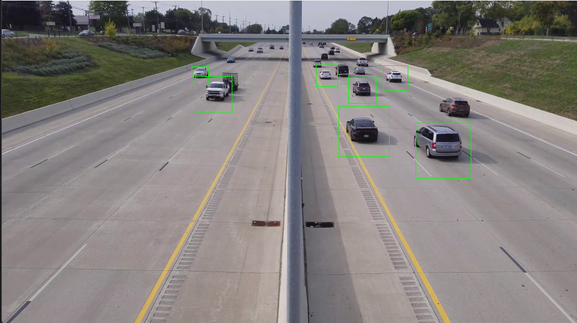

# Araba Tespiti Uygulaması

Bu proje, OpenCV ve Python kullanarak bir video dosyasında arabaları tespit etmek için basit bir örnek sunar. Bu örnek, haarcascade sınıflandırıcı kullanarak nesne tespiti yapmak için temel bir yapı sağlar.

## Gereksinimler

Bu projeyi çalıştırmak için aşağıdaki gereksinimlere ihtiyacınız vardır:

- Python 3.x
- NumPy
- OpenCV (cv2)

Gereksinimleri yüklemek için, aşağıdaki komutları kullanabilirsiniz:

```bash
pip install numpy
pip install opencv-python

```

